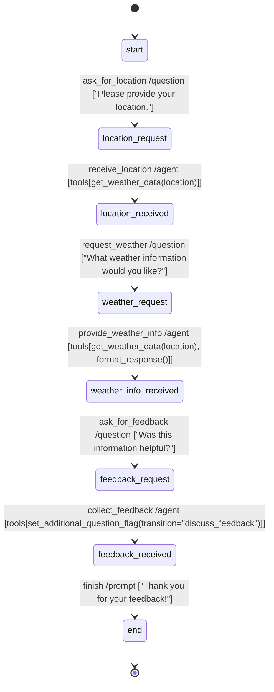

```mermaid
stateDiagram-v2
    [*] --> start
    start --> location_request : ask_for_location /question ["Please provide your location."]
    location_request --> location_received : receive_location /agent [tools[get_weather_data(location)]]
    location_received --> weather_request : request_weather /question ["What weather information would you like?"]
    weather_request --> weather_info_received : provide_weather_info /agent [tools[get_weather_data(location), format_response()]]
    weather_info_received --> feedback_request : ask_for_feedback /question ["Was this information helpful?"]
    feedback_request --> feedback_received : collect_feedback /agent [tools[set_additional_question_flag(transition="discuss_feedback")]]
    feedback_received --> end : finish /prompt ["Thank you for your feedback!"]
    end --> [*]
```