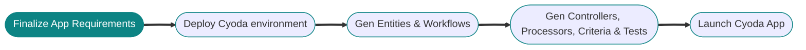

Next up: functional requirements.
Stay tuned — thoughtful thinking in progress. 🧠✨

```mermaid
graph LR
    A([Finalize App Requirements]):::done e1@
    ==> B([Deploy Cyoda environment]):::bar
    B e2@ ==> C([Gen Entities & Workflows]):::bar
    C e3@ ==> D([Gen Controllers, Processors, Criteria & Tests]):::bar
    D e4@ ==> E([Launch Cyoda App]):::bar

    classDef bar stroke:#0D8484
    classDef done fill:#0D8484,stroke:#0D8484,color:#fff
```
