You’ve just built a working sketch of your Cyoda application. This marks the beginning of something powerful.

```mermaid
%%{init: {'theme':'base','themeVariables':{
  'primaryColor':'#ECF8F8','primaryTextColor':'#083A3A','primaryBorderColor':'#0D8484',
  'lineColor':'#0D8484','fontFamily':'Inter, Arial, sans-serif','edgeLabelBackground':'#FFFFFF'
}}}%%
graph LR
    S((Start)):::start ==> A([🏆 Finalize App Requirements]):::done
    A e1@ ==> B([🏆 Deploy Cyoda environment]):::done
    B e2@ ==> C([🏆 Gen Entities & Workflows]):::done
    C e3@ ==> D([🏆 Gen Controllers, Processors, Criteria]):::done
    D e4@ ==> E([🚀 Launch Cyoda App]):::next

    %% animate handoff to next step (E)
    e4@{ animate: true }

    classDef start fill:#FFFFFF,stroke:#0D8484,stroke-width:2px,color:#083A3A
    classDef bar   fill:#ECF8F8,stroke:#0D8484,stroke-width:2px,rx:12,ry:12,color:#083A3A
    classDef done  fill:#0D8484,stroke:#0D8484,stroke-width:2px,rx:12,ry:12,color:#FFFFFF
    classDef next  fill:#FFFFFF,stroke:#0D8484,stroke-width:3px,stroke-dasharray:6 4,rx:12,ry:12,color:#083A3A
    linkStyle default stroke:#0D8484,stroke-width:2px,opacity:0.95
```

Next, we’ll convert this prototype into a full application that connects directly to your Cyoda Cloud environment.

By doing so, you gain:

✅ A robust, event-driven backend on a single, coherent platform

✅ Scalable, transactional architecture with far less complexity

✅ Clear, maintainable data models and workflows

✅ Enterprise-grade reliability, built in

✅ An ecosystem that accelerates delivery and adapts with your needs

👍 Let’s bring your prototype to life in the Cyoda Cloud.

**You'll see a notification soon**
