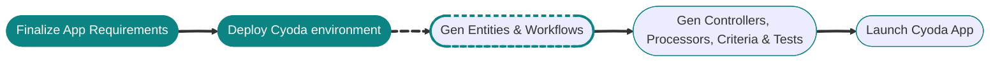

🚀 We will start environment deployment if it's not yet deployed. This process will set up your Cyoda environment with the necessary configurations.

Please wait while we prepare your deployment environment...

