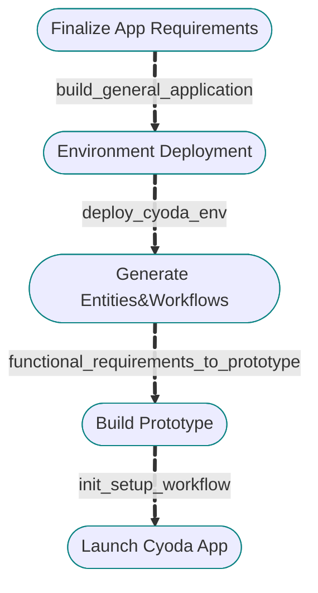

👋 Welcome to Cyoda Application Builder! Let’s build something working together! We are going to go through the following steps:

   
   
🧐 Learn more about Cyoda on [Our website](https://cyoda.com) and [Docs](https://docs.cyoda.net)
