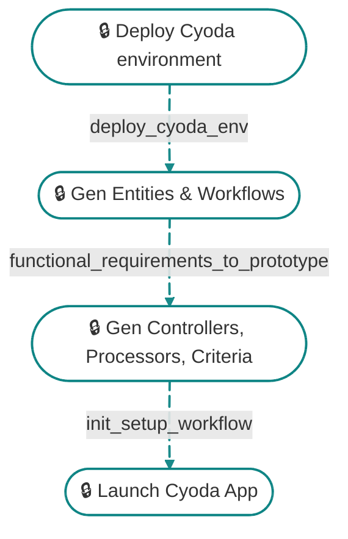

👋 Welcome to Cyoda Application Builder (Optimized flow)!

I will go through the following steps on my own. 

This will take from 10 to 30 minutes depending on the complexity of the application.

**Please make sure you've logged in to your account so that we could prepare your environment.**

  
Once the application is ready, I will start launch assistant, so that we can start your application together.

🧐 Learn more about Cyoda on [Our website](https://cyoda.com) and [Docs](https://docs.cyoda.net)
