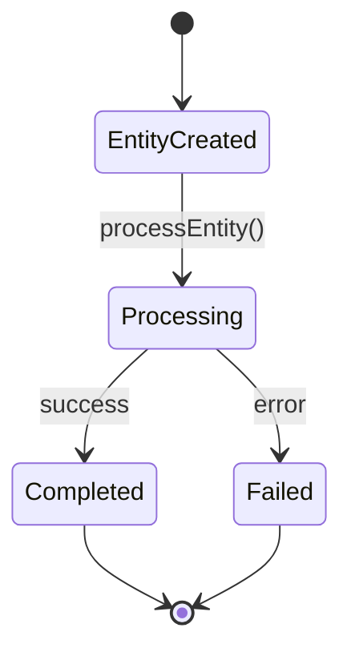

Please help me define the functional requirements for my project using an Event-Driven Architecture (EDA) approach.

## IMPORTANT EDA CONCEPTS:
In Event-Driven Architecture:
- Each entity add operation is an **EVENT** that triggers automated processing
- When you save an entity, Cyoda automatically calls `process{EntityName}()` events if there is only one processor
- When you save an entity, Cyoda automatically calls process{EntityName}{ProcessorName} events if the user explicitly asks for processor
- When you save an entity, Cyoda automatically validates the entity using check{EntityName}{CriteriaName} events if the user explicitly asks for criteria/conditions/validations/checks
- **EDA Principle**: Favor immutable entity creation over updates/deletes to maintain event history. Do not add update/delete endpoints unless user wants it explicitly.
- Example: Save a `Job` entity → triggers `processJob()` event → performs data ingestion
- Focus on business entities, job entities, or orchestration entities that represent your domain
- **Key Pattern**: Entity persistence triggers the process method that does the heavy lifting
- **EDA Principle**: Favor immutable entity creation over updates/deletes to maintain event history

## RESPONSE STRUCTURE:
**Start your answer with outlining the entities and their fields in this format:**

### 1. Entity Definitions
```
EntityName:
- field1: DataType (description/purpose)
- field2: DataType (description/purpose)
 Do not use enum - not supported temporarily.
```

### 2. Process Method Flows
**Continue with explaining the basic flow of each processEntityName() method:**

**Example:**
```
processJob() Flow:
1. Initial State: Job created with PENDING status
2. Validation: Check job parameters and data sources
3. Processing: Execute data ingestion/transformation
4. Completion: Update status to COMPLETED/FAILED
5. Notification: Send results to configured endpoints
```

## REQUIREMENTS TO DEFINE:

### 1. Business Entities (Max 3, Min 1)
- **Orchestration entities** (Job, Task, Workflow) take precedence
- **Business domain entities** (Order, Customer, Product) are secondary
- **Limit**: Only ONE orchestration entity allowed
- **Requirement**: At least one entity is mandatory

### 2. API Endpoints Design Rules
- **POST endpoints**: Entity creation (triggers events) + business logic. POST endpoint that adds an entity should return only entity `technicalId` - this field is not included in the entity itself, it's a datastore imitated specific field. Nothing else.
- **GET endpoints**: ONLY for retrieving stored application results
- **GET by technicalId**: ONLY for retrieving stored application results by technicalId - should be present for all entities that are created via POST endpoints.
- **GET by condition**: ONLY for retrieving stored application results by non-technicalId fields - should be present only if explicitly asked by the user.
- **GET all: optional.
- If you have an orchestration entity (like Job, Task, Workflow), it should have a POST endpoint to create it, and a GET by technicalId to retrieve it. You will most likely not need any other POST endpoints for business entities as saving business entity is done via the process method.
- **Business logic rule**: External data sources, calculations, processing → POST endpoints
- **EDA Principle**: Favor immutable entity creation over updates/deletes to maintain event history. Avoid update/delete endpoints unless user wants it explicitly.
- **Data Modification**: Instead of PUT/PATCH/DELETE, use POST to create new entity states or status changes. Apply only if the user explicitly asks updates/deletes.
This architectural decision aligns well with modern microservices and event-driven patterns where data flows through events rather than direct modifications

### 3. Event Processing Workflows
Detail what happens in each `processEntityName()` method after entity persistence.

### 4. Request/Response Formats
Specify JSON structures for all API endpoints.

## VISUAL REPRESENTATION:
Provide Mermaid diagrams showing:

**State Diagram Example:**


**Required Diagrams:**
- Entity lifecycle state diagrams
- Event-driven processing chains
- User interaction sequence flows

## FORMATTING REQUIREMENTS:
- Keep requirements minimalistic and focused
- **Each Mermaid diagram must be in complete markdown code blocks**
- Start with ```mermaid and end with ``` on separate lines
- Return markdown document without triple backtick wrapping
- Min 1 entity is mandatory. Max 3 entities.
 - If there is an orchestration entity (like Job, Task, Workflow), it should be the first one defined.
- Ensure all Mermaid blocks are properly closed